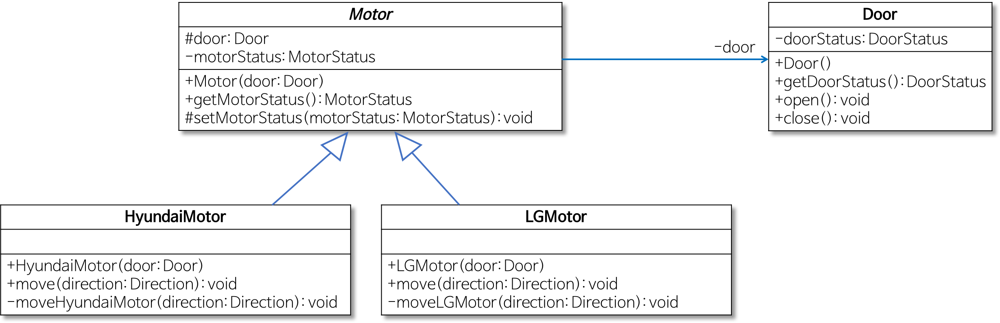

# 경계

## Key Word

- interface
- 확장
- 유연함

---

BAD ❌

```java
Map sensors = new HashMap();
Sensor s = (Sensor)sensors.get(sensorId);
```

GOOD ✅

```java
public Class Sensors {
    private Map sensors = new HashMap();

    public Sensors getById(String id) {
        retrun (Sensors) sensors.get(id);
    }
}
```

1. 사용자가 쓰고 싶지 않은 Map 의 기능을 사용하게 됨
2. Map 인터페이스가 변할 경우 수정해야 하는 코드가 많아진다

---

# 학습 테스트

- 우리는 많은 기능을 빠르게 출시하기위해 외부 라이브러리/프레임워크를 사용
- 하지만 외부 코드를 사용할 경우 학습에 많은 시간이 필요
- 문제 발생시 문제의 원인을 명확히 알기 힘듬
- 간단한 테스트를 작성해서 API 사용법을 익히고 학습함

---

```java
@Test
public void fail_without_appender() {
    Logger logger = Logger.getLogger("MyLogger");
    logger.info("Hello");
}

@Test
public void fail_without_stream() {
    Logger logger = Logger.getLogger("MyLogger");
    ConsoleAppender appender = new ConsoleAppender();
    logger.addAppender(appender);
    logger.info("Hello");
}

@Test
public void success() {
    Logger logger = Logger.getLogger("MyLogger");
    logger.removeAllAppenders();
    logger.addAppender(
        new ConsoleAppender(
            new PatternLayout("%p %t %m%n"),
            ConsoleAppender.SYSTEM_OUT
        )
    );
    logger.info("Hello");
}

....
```

---

# 학습 테스트를 해야하는 이유

- 외부 코드를 익히는 시간은 어쩔수 없이 들어간다
- 외부 코드의 이해도를 높히는 정확한 방법
- 외부 코드의 변경이 생기더라도 항상 같은 결과를 검증할 수 있다.

---

# 아직 존재하지 않는 코드 사용하기 = interface

- 또 다른 경계는 아는 코드와 모르는 코드
- 알수 없을 수도 있고, 알려고 하지 않을 수 도 있다
- 또한 확장에 유리하고 협업에 유리하다
  

---
